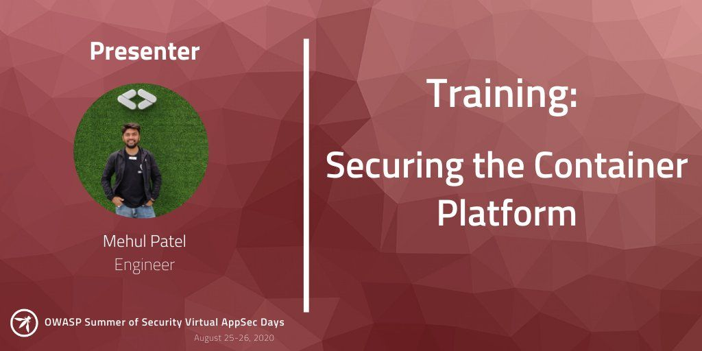
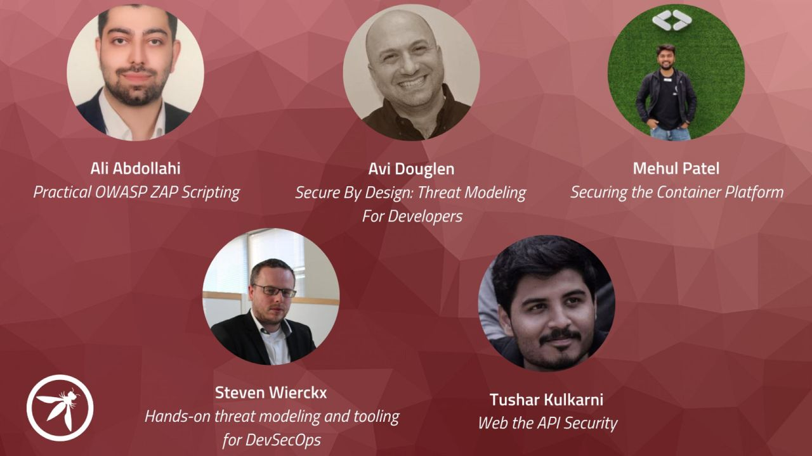

# OWASP Foundation AppSec Days - Summer of Security

**About** : The OWASP Foundation is hosting AppSec Days. Virtual training courses will be given on June 23-24, July 28-29, and August 25-26. The virtual training classes are 8 hour courses offered in 4-hour blocks on the two days above in each month. 

### Talk Details 

* **Title**: Securing the Container Platform
* **Talk Abstract**: In this session, I'm presenting 🧑‍💻 training for two days on a container security 
* **Date**: August 25-26 2020
* **Time**: 2 Days 

Special thanks to [OWASP Foundation](https://twitter.com/owasp) for hosting me.

#### Event type: Close (Based on Registration)

Feel free to ping me anytime on [Telegram](http://telegram.me/rowdymehul) or [Twitter](http://twitter.com/rowdymehul) and I’m happy to chat with you.

For any queries raise a [issue](https://github.com/rowdymehul/AppSec-Days-Summer-of-Security/issues) and please feel free to submit a PR anytime :)

